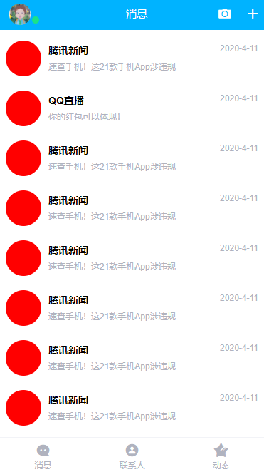

# vue-qq

> 第一次用Vue模仿手机QQ做的项目。代码有点乱。
>
> 登入账户：111，密码：111
>
> 只有前端所以很多功能没有做（比如：注册，聊天。。）

#### 项目展示

登入页：

 

主页：




## Build Setup

``` bash
# install dependencies
npm install

# serve with hot reload at localhost:8080
npm run dev

# build for production with minification
npm run build

# build for production and view the bundle analyzer report
npm run build --report
```

For a detailed explanation on how things work, check out the [guide](http://vuejs-templates.github.io/webpack/) and [docs for vue-loader](http://vuejs.github.io/vue-loader).
